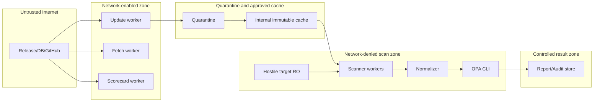
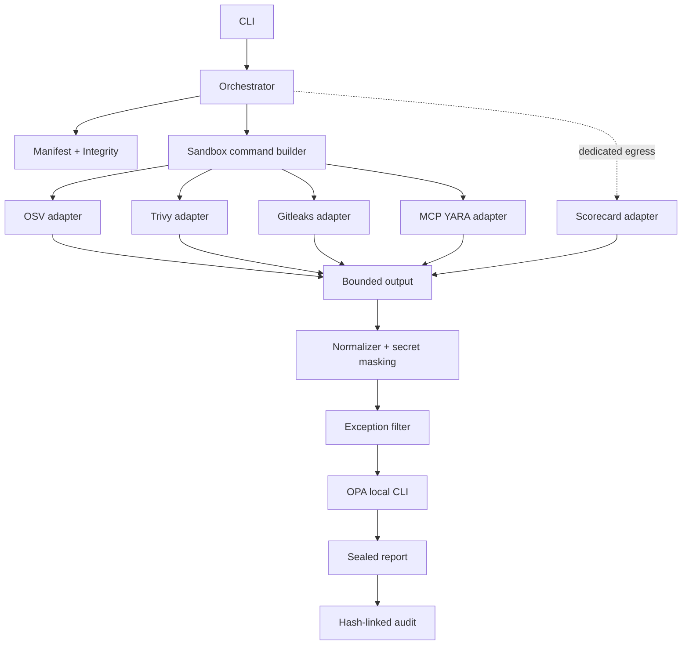
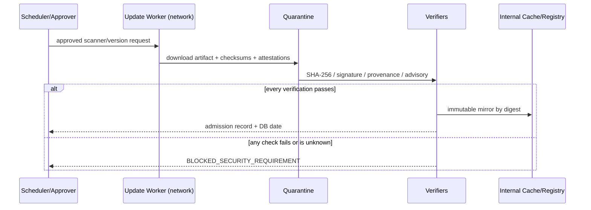
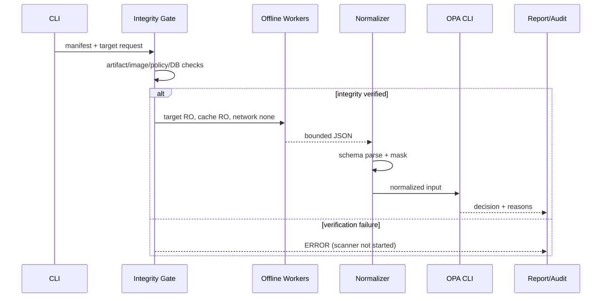

# OSS / MCP Security Gate 詳細設計

文書version: 1.0.0

確認日: 2026-09-24

## 1. Purpose

OSSまたはMCPを導入する前に、複数の静的Scanner signalを共通modelへ正規化し、OPAで `ALLOW` / `REVIEW` / `BLOCK` / `ERROR` の判断材料を再現可能に生成する。安全の断定ではなく、明示した制約下で既知riskを低減する。

## 2. Scope

入力はlocal directoryと、そこに置かれたMCP tools/prompts/resources JSON snapshot。public repository URLはScorecard評価識別子としてだけ扱い、MVPはrepository cloneを実装しない。ScannerはOSV-Scanner、Trivy、Gitleaks、Scorecard、Cisco MCP Scanner static/YARA、Policy engineはOPAに限定する。

## 3. Non-goals

target build/test/install、dynamic analysis、自動修復、dependency update、live MCP接続、MCP実行、external LLM、VirusTotal、Cisco cloud API、malware完全判定、formal safety proof、Web UIは対象外。Syft/Grype/Semgrep/Falco/Snykは追加しない。

## 4. Assumptions

- productionはhardening済みLinux + rootless/適切に隔離されたcontainer runtime。
- internal registry/cacheとegress enforcing proxyは組織が提供する。
- Update workerとScan workerは別identity/host policyを持つ。
- manifest/policy/exceptionはSecurity Gate管理repositoryからread-only配布し、target提供物を読まない。
- wall clockは信頼でき、audit storeはaccess control/retentionを持つ。

## 5. Threat Model

攻撃者はtarget contents、archive、lockfile、MCP metadata、scanner outputを制御できる。Scanner release/DB/registry/update channelも侵害され得る。狙いはcredential/source流出、host code execution、resource exhaustion、result改ざん、false negative、exception abuse。Trustしない対象を「Scanner、Target、Internet、raw result」、Trust anchorを「承認manifest/policy、internal mirror、platform isolation、reviewer」とする。

## 6. Assets

source、customer/internal data、API/cloud/SSH/OAuth/CI credential、production、build/release pipeline、Scanner artifact/DB/policy、normalized findings、decision/audit log。raw Secret valueは保存対象ではなく、直ちにredactすべき有害dataとして扱う。

## 7. Trust Boundaries

Boundary crossingではdigest/schema/size/expiryを検証する。Z1 credentialはZ3へ渡さない。Z3からInternetへのrouteを作らない。

## 8. Architecture

Go applicationは第三者moduleを持たず、外部ScannerとOPAをsubprocess boundaryで分離する。

## 9. Component Design

- `cmd/security-gate`: argument/exit codeだけを扱う。
- `internal/orchestrator`: required scanner、integrity、execution、normalization、policy、reportを順序制御。
- `internal/manifest` / `integrity`: JSON-compatible YAMLをstrictに読込み、artifact SHA-256を照合。
- `internal/sandbox` / `runner`: shellを使わずargument arrayを組み、environmentをallowlist化、timeout/output cap。
- `internal/normalize`: vendor JSONを共通Findingへ変換。raw secretを保持しない。
- `internal/policy`: productionではOPA CLI。Go evaluatorはtest/referenceでありfailure fallbackではない。
- `internal/report` / `audit`: defensive masking、result hash、hash-linked JSONL。

## 10. Scanner Adapter Interface

概念interfaceは `Required(Request)`, `DockerCommand(ApprovedScanner, Request)`, `Normalize(raw, context)`。adapterはtargetを変更せず、network requirement、allowed exit code、timeout、output limitを宣言する。scanner固有JSONのschema変更はfixture contract testで検知する。

## 11. Scannerごとの実行方法

- OSV: `scan source --recursive --format=json --offline-vulnerabilities --no-resolve --config=<Gate config> /target`。`fix`、target config、package resolver実行は禁止。
- Trivy: `fs --format=json --scanners=vuln,misconfig,secret --skip-db-update --skip-java-db-update --skip-check-update --offline-scan --disable-telemetry`。plugin/remote moduleは禁止。
- Gitleaks: `dir /target --report-format=json --redact=100 --max-archive-depth=0`。Git commandやtarget hookを実行しない。
- Scorecard: public GitHub repoだけ。GitHub限定egress proxyとread-only identityがない場合は`UNSUPPORTED_SECURITY_REQUIREMENT`。aggregate scoreだけでdecisionしない。
- Cisco: `static` subcommand、`--analyzers yara`、snapshot fileだけ。server URL/config discovery/live/LLM/API/VTは禁止。
- OPA: `opa eval --data <trusted policies> --stdin-input data.security_gate.result`。server modeは使用しない。

実際のCLI optionは固定versionのacceptance testで確認し、upstream変更時はmanifestだけ先行更新しない。

## 12. Sandbox Design

`docker run --rm --pull never --network none --read-only --user 65532:65532 --cap-drop ALL --security-opt no-new-privileges:true`を基礎に、CPU 1、memory 768 MiB、memory-swap同値、PID 128、tmpfs 64 MiB、wall timeout、output capを付ける。targetとcacheはread-only。privileged、cap-add、host PID/IPC/network、host root、Docker/containerd socket、ServiceAccount tokenは禁止。条件を外さないと動かないScannerはUNSUPPORTED。

## 13. Network Design

OSV/Trivy/Gitleaks/MCP/OPAはnone。DB updateとartifact updateはUpdate worker、将来のGit取得はFetch worker、Scorecardは専用worker。ScorecardのallowlistはFQDN-aware proxy/firewallで `api.github.com` / `github.com` だけを許可し、DNS rebinding、direct IP、CONNECT先を制御する。Docker bridge名だけでは制御成立とみなさない。

## 14. Update Pipeline

Update scriptはquarantine downloadとSHAまで自動化し、signature/provenance/advisory承認前にruntime pathへ移さない。DB/check bundlesも同じく世代・digest・sourceを記録する。

## 15. Scan Pipeline

## 16. Scanner Integrity Verification

manifestはname、version、official URI、artifact SHA-256、worker image digest、signature/provenance method、approval/advisory dateを保持。binary/archive hash不一致は起動前ERROR。containerはtagでなくdigest、`--pull never`。zero digest sentinelは未provisionとして拒否する。OSVはSLSA verifier、TrivyはSigstore bundle、Cisco wheelはPyPI attestation、Scorecard/OPAはrelease checksum/attestationを確認する。Gitleaksでupstream provenanceが確認できない場合は組織risk acceptanceなしにproduction admissionしない。

## 17. Finding Schema

`schemas/finding.schema.json`を正とする。schema/version/scanner/digest/target/category/id/severity/confidence/title/statusが必須。evidenceは必要最小限でraw matchを禁止。severityはUNKNOWN/INFO/LOW/MEDIUM/HIGH/CRITICAL、confidenceはLOW/MEDIUM/HIGH。

## 18. Report Schema

`schemas/report.schema.json`を正とし、scan ID、target、policy version、decision/reasons、全ScannerRun、Findings、used exceptions、metadata、result hashを持つ。ScannerRunはCOMPLETE/PARTIAL/FAILED/TIMEOUT/UNSUPPORTED。raw outputは含めない。

## 19. OPA Policy Design

policyは`policies/main.rego`、version 1.0.0。TargetのRegoを読み込まない。OPA出力がundefined/malformed/non-zero/timeoutならERROR。policy変更は`opa test policies --fail-on-empty`必須。policy directoryもrelease artifactとしてhash/署名対象にすることをproduction requirementとする。

## 20. Decision Logic

優先順位はERROR > BLOCK > REVIEW > ALLOW。

- ERROR: scanner failed/timeout、integrity failureで開始不能、malformed output、OPA failure、ScannerRunなし。
- BLOCK: confirmed secret、malicious MCP YARA、critical misconfiguration、integrity/prohibited capability finding。
- REVIEW: HIGH/CRITICAL vulnerability、unknown severity、PARTIAL/UNSUPPORTED、stale DB、重大Scorecard signal。
- ALLOW: required scanがすべてCOMPLETE、integrity/DB/policyが有効、blocking/review findingなしの場合だけ。

Severityだけでなくcategory、confidence、exploitability field、completeness、exceptionをinputに残す。

## 21. Exception Management

finding ID、justification、approver、created_at、expires_at、scope、evidenceを必須化。expiryなし/逆転/malformedは全fileを拒否する。target scope一致と未失効だけを適用。Secret、integrity、prohibited capability、MCP YARAは自動override不可。利用したexceptionをreport/auditへIDだけ記録する。

## 22. Audit Logging

who、target、timestamp、scanner version/digest/DB、policy、status、decision、exception IDs、result hashを0600 JSONLへ追記。各recordはprevious hashを含む。productionではappend-only/WORM storeへ転送する。Secret/token/source全文/raw scanner outputは禁止。

## 23. Secret Handling

Gitleaks側100% redactに加え、normalizerはsensitive keyを`[REDACTED]`、known token patternをprefix+asteriskへ変換する。report writerでも再maskする。raw outputはmemory内bounded bufferのみで永続化しない。error textにもraw output全体を添付しない運用とし、CI console retentionを最小化する。

## 24. Error Handling

未知errorをALLOWへ変換しない。scanner exit 1はOSV/Gitleaksのfinding検出時だけ許容し、その他non-zeroはFAILED。JSON parse、manifest、exception、audit/report writeの失敗はERROR。partial resultを残す場合もdecisionを低下させない。

## 25. Timeout / Resource Limit

per-scanner 120–180秒、OPA 10秒、output 2–20 MiB。Docker CPU/memory/PID/tmpfs limitを併用する。timeout時はprocess/containerをcontext cancellationで停止しTIMEOUT→ERROR。limitを緩めて自動retryしない。

## 26. Data Retention

raw outputは保存しない。report/auditは組織分類に従い、例としてreport 90日、audit 1年、quarantine failed artifact 30日、verified scanner/DBはcurrent+previous 2世代とする。法務/incident holdを優先し、削除job自体をauditする。Secret発見時はretentionよりrevoke/rotationを先に行う。

## 27. Security Controls

preventive: digest pin、network none、non-root、RO、cap drop、credential separation。detective: Scanner findings、integrity、DB age、audit hash、policy test。corrective: revoke/rotate、manifest deny、rollback、rescan。administrative: two-person approval、exception expiry、advisory review cadence。

## 28. Observability

metricはscan duration/status、finding count by category/severity、timeout、output limit、integrity failure、DB age、policy version、exception expiry count。Secret value、path contents、token、MCP raw description全文はlabel/logにしない。alertはintegrity failure、ERROR spike、DB age breach、unexpected scanner digest、audit chain break。

## 29. Test Strategy

Go unit testsはparser、normalizer、severity、mask、policy reference、expiry、timeout、malformed JSON、hash mismatch、report masking、sandbox args。integration fixtureはOSV/Trivy/Gitleaks/Scorecard/MCP JSONからFindingを確認。OPA testはALLOW/ERROR/BLOCK/REVIEWを固定inputで確認。release buildは`-trimpath`、CGO disabled。

## 30. Security Test Strategy

static negative testはnetwork none、RO mount/root、non-root、cap drop、no-new-privileges、resource limit、socket/host namespace不在を検証。`tests/runtime-isolation.sh`は専用Linux CIで、reviewed digest-pinned test imageだけを使い、target write、Internet/cloud metadata、Docker/containerd socket accessが失敗することを確認する。malformed output、scanner failure、stale DB、hash mismatch、timeout、raw secret不在も自動testする。

## 31. Failure Scenarios

| Failure | Status/Decision | Action |
|---|---|---|
| artifact hash mismatch | FAILED / ERROR | 起動せずquarantine、incident review |
| Scanner crash | FAILED / ERROR | outputを保存せずversion/advisory確認 |
| timeout/output limit | TIMEOUT/FAILED / ERROR | target/fixtureを安全に調査 |
| unsupported ecosystem | UNSUPPORTED / REVIEW | manual review、勝手にbuildしない |
| stale DB | COMPLETEでもREVIEW | Update pipeline復旧 |
| malformed JSON | FAILED / ERROR | adapter/upstream schema差分確認 |
| OPA failure | ERROR | policy/version/CLI integrity確認 |
| audit write failure | ERROR | resultを正式承認しない |

## 32. Upgrade Procedure

新versionをquarantineへ取得、official advisory/changelog確認、checksum/signature/provenance検証、fixture schema差分更新、unit/OPA/runtime isolation test、internal image build+sign、digest記録、staging shadow scan、二者承認、本番manifest rollout。`latest`や自動追従は禁止。

## 33. Rollback Procedure

previous approved manifest/image/DB/policy bundleをimmutable cacheから選び、known advisoryの影響外であることを再確認する。manifestを署名付きでrollbackし、running jobを停止、新旧decision差分を監査する。脆弱versionへのrollbackしかない場合はscannerをdisableしてERRORにし、安全性を下げて継続しない。

## 34. Scanner compromise対応

該当digestをregistry deny、update/scan credentialをrotate、過去ALLOWをinvalidate、audit/report/registry transparencyを保全、clean-roomで別version再検証、影響期間の全targetをrescanする。Scannerが生成した「問題なし」も信用しない。詳細は`SECURITY.md`。

## 35. Vulnerability DB compromise対応

DB digestをdenyし、previous known-good世代へnetworkなしでrollback。affected期間のscanをREVIEWへ降格し、別source/advisoryとの差分を調査。DB extraction path traversalを想定しquarantine/container内で展開し、hostへ直接展開しない。

## 36. 今後のDynamic Analysis

別Phaseでephemeral VM/microVM、synthetic credential、fake services、egress capture、system-call policyを使う案を検討する。MVP workerへcapability/networkを追加して代用しない。承認、legal/privacy、test data設計が前提。

## 37. 今後のMCP live scanning

live接続は専用sandbox、no production credential、mock data、tool call deny-by-default、human approval、definition hash pin、request/response size/timeout、egress proxy、session isolationを設計してから追加する。現MVPはserverを起動・接続・tool実行しない。

## 38. Known Limitations

- worker image digestはdeployment固有。配布manifestのzero sentinelを内部mirror digestへ承認更新するまでscan不能。
- Docker daemon停止中の開発端末ではruntime isolation/E2Eを実行できない。
- Scorecard FQDN egress enforcementは外部network controlが必要。
- static scannerはruntime behavior、unknown/obfuscated threat、native binary intentを完全検出しない。
- OSV/Trivyはlockfile/package metadata品質とDB coverageに依存。
- Gitleaks/Trivy Secretはfalse positive/negativeがある。
- audit hash chainだけでは管理者によるlog全削除を防げず、external WORM storeが必要。

## 39. Residual Risks

正規publisher/build基盤の侵害、container runtime/kernel escape、未知parser bug、timing/resource side channel、reviewer error、stolen approver identity、DB/advisory遅延、MCP semantic攻撃の言い換え、利用後のrug pullが残る。導入後もleast privilege、runtime monitoring、定期再scan、definition hash監視が必要。

## 40. References

すべて2026-09-24確認。一次情報を優先した。

- OSV-Scanner: [Docs](https://google.github.io/osv-scanner/), [Installation/provenance](https://google.github.io/osv-scanner/installation/), [Usage/offline](https://google.github.io/osv-scanner/usage/), [v2.6.0 release](https://github.com/google/osv-scanner/releases/tag/v2.6.0)
- Trivy: [Docs](https://trivy.dev/), [DB/offline controls](https://trivy.dev/latest/docs/configuration/db/), [Security Policy](https://github.com/aquasecurity/trivy/security/policy), [Advisories](https://github.com/aquasecurity/trivy/security/advisories), [v0.74.0 release](https://github.com/aquasecurity/trivy/releases/tag/v0.74.0)
- Trivy incidents/advisories: [Supply-chain compromise GHSA-69fq-xp46-6x23](https://github.com/aquasecurity/trivy/security/advisories/GHSA-69fq-xp46-6x23), [DB artifact path traversal GHSA-mcj4-mphf-j9ff](https://github.com/aquasecurity/trivy/security/advisories/GHSA-mcj4-mphf-j9ff), [Plugin path traversal GHSA-8rc5-4fr6-64pw](https://github.com/aquasecurity/trivy/security/advisories/GHSA-8rc5-4fr6-64pw)
- Gitleaks: [Repository](https://github.com/gitleaks/gitleaks), [Security Policy](https://github.com/gitleaks/gitleaks/security/policy), [v8.30.1 release](https://github.com/gitleaks/gitleaks/releases/tag/v8.30.1)
- OpenSSF Scorecard: [Repository/authentication](https://github.com/ossf/scorecard), [Check documentation](https://github.com/ossf/scorecard/blob/main/docs/checks.md), [v5.2.1 release](https://github.com/ossf/scorecard/releases/tag/v5.2.1)
- Cisco MCP Scanner: [Repository/static usage](https://github.com/cisco-ai-defense/mcp-scanner), [Architecture](https://github.com/cisco-ai-defense/mcp-scanner/blob/main/docs/architecture.md), [Security Policy](https://github.com/cisco-ai-defense/mcp-scanner/security/policy), [PyPI 4.8.4 attestation](https://pypi.org/project/cisco-ai-mcp-scanner/4.8.4/)
- OPA: [Documentation](https://www.openpolicyagent.org/docs), [CLI](https://www.openpolicyagent.org/docs/cli), [Policy testing](https://www.openpolicyagent.org/docs/policy-testing), [Security Policy](https://github.com/open-policy-agent/opa/security/policy), [Advisories](https://github.com/open-policy-agent/opa/security/advisories), [v1.20.2](https://github.com/open-policy-agent/opa/releases/tag/v1.20.2)
- MCP/OWASP: [MCP specification](https://modelcontextprotocol.io/specification/2026-07-28), [Security best practices](https://modelcontextprotocol.io/specification/2026-07-28/basic/security_best_practices), [OWASP MCP Security Cheat Sheet](https://cheatsheetseries.owasp.org/cheatsheets/MCP_Security_Cheat_Sheet.html)
- Supply chain verification: [SLSA v1.2](https://slsa.dev/spec/v1.2/), [SLSA provenance](https://slsa.dev/spec/v1.2/provenance), [Sigstore Cosign verify](https://docs.sigstore.dev/cosign/verifying/verify/)
