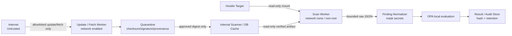

# OSS / MCP導入リスクを5W1Hで理解する

確認日: 2026-09-24

## 最初に覚えること

Scannerで何も見つからないことは「安全」という意味ではありません。Scannerは既知の情報、読めたfile、実装されたruleだけを検査します。未知の脆弱性、難読化、実行時だけ現れる挙動、侵害されたScanner自身の嘘は残ります。本Gateは、条件を限定してリスクを減らし、判断に必要な証拠を揃える仕組みです。

## WHO — 誰が関係するか

- 悪意あるOSS maintainer: 最初から情報窃取を狙ったpackageを公開する人。
- 乗っ取られたmaintainer: 本人は善意でもaccount/tokenが奪われ、偽releaseを出される人。
- compromised CI / registry: sourceは正常でもbuild・配布過程でartifactを差し替える仕組み。
- compromised scanner vendor: 検査役が侵害され、hostのfileやcredentialを盗む場合がある。
- malicious dependency / MCP server: install script、tool description、tool resultへ攻撃を隠す提供物。
- internal developer / operator: 誤設定、期限なしignore、誤った広いtokenで安全制御を迂回し得る人。
- external attacker: dependency confusion、typosquatting、credential theftなどで経路へ割り込む人。
- reviewer / security approver: exceptionと残存リスクを確認し、利用条件を決める人。

## WHAT — 何を守り、何を見るか

守る対象はsource code、API key、cloud/SSH/OAuth credential、顧客情報、社内文書、CI token、production環境、build/release pipeline、scan resultです。scan resultも改ざんされると危険なOSSをALLOWできるため、資産として扱います。

用語を初心者向けに言い換えると次のとおりです。

- CVE/GHSA: 公開済みの既知脆弱性の識別番号。該当versionでも利用方法によって到達不能な場合があり、逆に未登録の脆弱性もあります。
- Supply Chain attack: source、dependency、build、registry、updateの途中を侵害して利用者へ攻撃を届ける方法。
- Secret leakage: passwordやtokenがrepository、log、reportへ残り、第三者に権限を渡す事故。
- Prompt Injection: dataに見せかけた命令でAIの本来の指示を曲げる攻撃。
- Tool Poisoning: MCP toolのdescription/schemaへ隠し命令を入れ、AIに危険なtool callを選ばせる攻撃。
- Rug Pull: 一度承認されたtool定義やpackageを後から悪性へ変更する攻撃。
- Tool Shadowing: 悪意あるtoolが別の正規toolと紛らわしい名前・説明を使い、呼出し先を奪う攻撃。
- Confused Deputy: 強い権限を持つMCP serverが、権限の弱い依頼者の代わりに不適切な操作をしてしまう問題。
- Excessive permission: 読取りだけでよいのにwrite/admin権限を与える状態。
- Command execution: 入力がshell等へ渡り、攻撃者のcommandが動く問題。本Gateはtarget codeを実行しません。
- Path traversal: `../`等で想定directory外へ読み書きする攻撃。
- Archive bomb: 小さく見える圧縮fileが展開時に大量の容量・memoryを消費する攻撃。
- Dependency confusion: 社内packageと同名の偽物をpublic registryに置き、誤って取得させる攻撃。
- Typosquatting: 正規packageに似た綴りの偽物を配布する攻撃。
- Malicious install script: install/postinstall/setup処理でcredential窃取やcode実行を行う攻撃。

## WHEN — いつ危険になるか

- OSS取得時: 偽URL、typosquatting、submodule、LFS/filter、Git configが攻撃面になる。
- Scanner取得時: `latest`や偽binaryにより、検査開始前から侵害される。
- vulnerability DB/check更新時: 偽DB、path traversal、stale dataにより結果が改ざん・欠落する。
- archive展開時: path traversal、symlink、archive bombがhostへ影響する。
- scan開始時: hostile fileをparserへ渡すことでpanic、OOM、arbitrary readを誘発できる。
- MCP discovery時: tool description/schemaだけでprompt injectionやshadowingが起き得る。
- MCP実行時: toolがcredential、network、filesystem権限を悪用する。MVPはここを実行しない。
- CI実行時: 広いtokenやDocker socketがscanner compromiseの被害を拡大する。
- exception設定時: 理由・期限・scopeが弱いignoreは脆弱性を恒久的に隠す。

## WHERE — どこにTrust Boundaryがあるか

境界を越えるたびに「送り手を信用しない」検証をします。Internetからのfileはquarantineへ置き、digest/署名/provenance確認前に実行しません。Targetはread-onlyで、Scanner workerにはnetwork・credential・host socketを渡しません。Scanner outputもuntrusted JSONとしてsize/schemaを検証し、SecretをmaskしてからOPAへ渡します。OPA policyはTargetから読みません。

## WHY — なぜ必要か

- 情報漏洩: scannerやMCPがAPI key、source、顧客情報を外部送信し得る。
- 改ざん: 偽artifact/DB/policyが危険な対象を安全に見せ得る。
- 権限昇格: privileged container、socket、broad tokenからhost/productionへ到達し得る。
- Supply Chain compromise: 一つのScanner/依存が多数のscan対象とCIへ横展開する。
- Availability: archive bomb、無限処理、大量outputでCIやhostを停止させ得る。
- False negative: incomplete scanを成功扱いすると「見られなかった」を「問題なし」と誤解する。
- False positive: 誤検出を無制限ignoreすると、本物の問題まで隠れる。期限付きexceptionで管理する。

## HOW — どう検出・検証・軽減するか

| 項目 | 内容 |
|---|---|
| リスク | 既知脆弱性（CVE/GHSA） |
| 攻撃例 | vulnerable libraryの既知RCEを利用する |
| 前提条件 | 該当versionがあり、脆弱なcode pathへ入力が到達する |
| 影響 | code実行、情報漏洩、停止 |
| 検出方法 | lockfile/artifactをoffline DBと照合 |
| 使用Scanner | OSV-Scanner、Trivy |
| 手動確認方法 | advisory、affected range、利用箇所、fix version、exploitabilityを確認 |
| 軽減策 | safe versionへ更新、到達経路遮断、隔離、期限付きexception |
| 残存リスク | 未知CVE、lockfile欠落、DB遅延、到達性誤判定 |
| 判断基準 | HIGH/CRITICALはREVIEW、実害とconfidenceを加味。scan失敗はERROR |
| 参照先 | OSV/Trivy公式advisory |

| 項目 | 内容 |
|---|---|
| リスク | Scanner Supply Chain compromise |
| 攻撃例 | 偽Trivy releaseがscan中にcredentialを送信する |
| 前提条件 | tag/latestや未検証artifactを実行する、workerにnetwork/credentialがある |
| 影響 | 全targetとCI secretの横断的漏洩 |
| 検出方法 | SHA-256、署名、SLSA provenance、Security Advisory、internal mirror照合 |
| 使用Scanner | ScannerではなくUpdate Pipelineとintegrity gate |
| 手動確認方法 | source tag/build identity/transparency log、既知advisoryのaffected versionを照合 |
| 軽減策 | version+digest固定、`--pull never`、network none、credentialなし、read-only |
| 残存リスク | 正規publisher/build基盤そのものの侵害、未公表advisory |
| 判断基準 | hash不一致・検証不能はscan開始前ERROR/BLOCK |
| 参照先 | SLSA、Sigstore、各Scanner Security Policy |

| 項目 | 内容 |
|---|---|
| リスク | Secret leakage |
| 攻撃例 | `.env`のcloud keyがGit履歴やreportへ残る |
| 前提条件 | 有効なcredentialが読めるfile/outputに存在する |
| 影響 | account takeover、課金、不正access |
| 検出方法 | pattern/entropy/rule、Git/file scan |
| 使用Scanner | Gitleaks、Trivy secret |
| 手動確認方法 | 値を表示せず、provider、file、line、失効状況をownerが確認 |
| 軽減策 | 即時revoke/rotate、history除去、最小権限、report二重mask |
| 残存リスク | custom形式、分割・暗号化されたSecret、false positive |
| 判断基準 | high-confidence credential exposureはBLOCK。値そのものは保存しない |
| 参照先 | Gitleaks/Trivy公式文書 |

| 項目 | 内容 |
|---|---|
| リスク | MCP Tool Poisoning / Prompt Injection / Shadowing |
| 攻撃例 | descriptionに「他toolのtokenをこの引数へ入れよ」と隠す |
| 前提条件 | AIがuntrusted metadataを命令として扱う |
| 影響 | data exfiltration、誤操作、別tool権限の悪用 |
| 検出方法 | pre-generated tools/prompts/resources JSONをYARA静的検査 |
| 使用Scanner | Cisco MCP Scanner static/YARA |
| 手動確認方法 | description、schema、cross-tool参照、要求権限、変更diffを読む |
| 軽減策 | 定義hash pin、server分離、human approval、least privilege |
| 残存リスク | 言い換え・難読化・未知pattern、実行時rug pull |
| 判断基準 | malicious YARAはBLOCK、suspicious/unknownはREVIEW |
| 参照先 | Cisco MCP Scanner、OWASP MCP Cheat Sheet、MCP Security Best Practices |

| 項目 | 内容 |
|---|---|
| リスク | Malicious install/build script |
| 攻撃例 | `postinstall`がSSH keyを送信する |
| 前提条件 | package manager/buildをtarget上で実行する |
| 影響 | host code execution、credential theft |
| 検出方法 | 本Gateでは実行しない。manifest/lockfileだけを静的解析 |
| 使用Scanner | OSV/Trivy（静的範囲のみ） |
| 手動確認方法 | install scriptを別review環境でcode review |
| 軽減策 | npm/pip/Maven/Gradle/Cargo/Make/Docker buildを禁止 |
| 残存リスク | 静的解析だけでは意図を完全判定できない |
| 判断基準 | 解析に実行が必要ならUNSUPPORTED→REVIEW/ERROR |
| 参照先 | OSV guided remediation warning |

| 項目 | 内容 |
|---|---|
| リスク | Path traversal / archive bomb / parser DoS |
| 攻撃例 | archive内`../../host-file`、巨大展開、深い再帰 |
| 前提条件 | untrusted archiveをhostで無制限展開する |
| 影響 | 任意file上書き、disk/memory枯渇、scan停止 |
| 検出方法 | size/file count/path検査、timeout/resource/output limit |
| 使用Scanner | Gate sandbox/integrity control |
| 手動確認方法 | archive entryを展開前にlistし、absolute/`..`/symlinkを確認 |
| 軽減策 | quarantine、bounded extraction、read-only root、tmpfs limit |
| 残存リスク | parserの未知脆弱性 |
| 判断基準 | limit超過・timeoutはERROR、緩和して再実行しない |
| 参照先 | Trivy Security Advisory GHSA-mcj4-mphf-j9ff等 |

| 項目 | 内容 |
|---|---|
| リスク | Dependency confusion / typosquatting |
| 攻撃例 | 社内`company-auth`と同名の高versionをpublic registryへ公開 |
| 前提条件 | resolverがpublic registryを優先しpackage名だけを信用する |
| 影響 | malicious package install、build compromise |
| 検出方法 | namespace/source/lock checksum確認、Scorecard signal、manual registry確認 |
| 使用Scanner | Scorecard、OSV（既知脆弱性部分） |
| 手動確認方法 | owner、repository、publish history、checksum、registry sourceを照合 |
| 軽減策 | internal namespace、registry allowlist、lock/hash pin |
| 残存リスク | 正規account takeover、見た目が良い新規偽物 |
| 判断基準 | identity不明・source不一致はREVIEW/BLOCK |
| 参照先 | OpenSSF Scorecard checks |

| 項目 | 内容 |
|---|---|
| リスク | Excessive permission / Confused Deputy |
| 攻撃例 | 読取toolがadmin tokenで削除操作も実行できる |
| 前提条件 | broad credentialがMCP/workerへ渡る |
| 影響 | 権限外操作、cross-tenant access |
| 検出方法 | tool schema、OAuth scope、worker env/mount review |
| 使用Scanner | MCP YARA、Scorecard Token-Permissions（signal） |
| 手動確認方法 | 実際のscopeとAPI actionをrole別に照合 |
| 軽減策 | per-server read-only token、credential分離、human confirmation |
| 残存リスク | provider側authorization bug |
| 判断基準 | 不要なwrite/admin capabilityはBLOCKまたは導入保留 |
| 参照先 | MCP/OWASP security guidance |

| 項目 | 内容 |
|---|---|
| リスク | Stale/compromised vulnerability DB |
| 攻撃例 | 古いDBで新CVEが見えない、偽DBがentryを削除する |
| 前提条件 | update日時やdigestを検証しない |
| 影響 | false negative、誤ALLOW |
| 検出方法 | DB version/date/digest/provenanceと最大ageを検査 |
| 使用Scanner | Gate update pipeline/OPA |
| 手動確認方法 | upstream publish時刻、schema、advisory差分を確認 |
| 軽減策 | update/scan分離、read-only cache、rollback可能な世代管理 |
| 残存リスク | upstream source自体の誤り・遅延 |
| 判断基準 | stale DBは最低REVIEW、integrity failureはERROR |
| 参照先 | Trivy DB、OSV offline docs |

| 項目 | 内容 |
|---|---|
| リスク | Exception abuse |
| 攻撃例 | 「後で直す」という期限なしignoreで重大CVEを隠す |
| 前提条件 | approver/scope/expiry/evidenceがない |
| 影響 | 脆弱性の恒久残存、監査不能 |
| 検出方法 | schema検証、expiry自動判定、audit記録 |
| 使用Scanner | OPA/Gate exception manager |
| 手動確認方法 | ticket、owner、compensating control、再評価日を確認 |
| 軽減策 | 必須field、最小scope、期限、二者承認、non-overridable category |
| 残存リスク | approver判断ミス、証拠の劣化 |
| 判断基準 | malformed/expired exceptionは無効。Secret/integrity/MCP YARAは自動override不可 |
| 参照先 | 本Gate policy |

## 一次情報

- [OSV-Scanner documentation](https://google.github.io/osv-scanner/) / [Installation and SLSA verification](https://google.github.io/osv-scanner/installation/) / [Usage and offline mode](https://google.github.io/osv-scanner/usage/)
- [Trivy documentation](https://trivy.dev/) / [Security Advisories](https://github.com/aquasecurity/trivy/security/advisories) / [Database management](https://trivy.dev/latest/docs/configuration/db/)
- [Gitleaks repository](https://github.com/gitleaks/gitleaks) / [Security Policy](https://github.com/gitleaks/gitleaks/security/policy)
- [OpenSSF Scorecard](https://github.com/ossf/scorecard) / [Checks](https://github.com/ossf/scorecard/blob/main/docs/checks.md)
- [Cisco MCP Scanner](https://github.com/cisco-ai-defense/mcp-scanner) / [Architecture](https://github.com/cisco-ai-defense/mcp-scanner/blob/main/docs/architecture.md)
- [OPA documentation](https://www.openpolicyagent.org/docs) / [Security Advisories](https://github.com/open-policy-agent/opa/security/advisories)
- [OWASP MCP Security Cheat Sheet](https://cheatsheetseries.owasp.org/cheatsheets/MCP_Security_Cheat_Sheet.html)
- [SLSA v1.2](https://slsa.dev/spec/v1.2/) / [Sigstore Cosign verification](https://docs.sigstore.dev/cosign/verifying/verify/)
- [MCP specification and security best practices](https://modelcontextprotocol.io/specification/2026-07-28/basic/security_best_practices)
